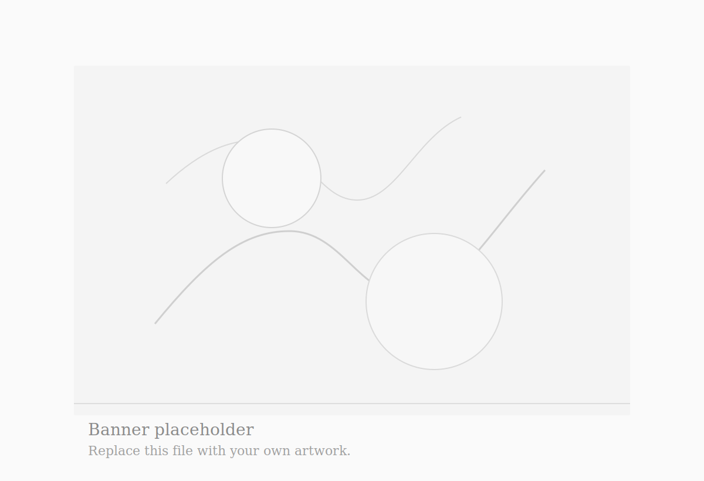

# Personal Art Blog

这是一个纯静态的个人博客原型，适合展示：

- 绘画作品
- 随笔和创作手记
- 摄影与生活照片

## 文件

- `index.html`：首页结构
- `styles.css`：视觉样式
- `script.js`：滚动显现动画
- `images/banner-placeholder.svg`：首页 banner 占位图
- `posts/`：文章详情页示例

## 本地预览

直接在浏览器打开 `index.html` 即可。

## 以后怎么改

### 1. 替换 banner 画作

当前首页 banner 用的是：

- `images/banner-placeholder.svg`

你以后可以：

1. 直接把这个文件替换成你的图片。
2. 或者新增一个图片，例如 `images/my-painting.jpg`。
3. 然后把 `index.html` 里的这行改掉：

```html

```

改成：

```html

```

### 2. 新增文章

首页每篇文章都是一个 `post-card`，详情页在 `posts/` 目录里。

你可以：

1. 复制一个现有的 `posts/*.html`
2. 改标题、日期、正文和图片
3. 再回到 `index.html`，增加一张文章卡片并把链接指过去

## 下一步建议

1. 把占位文案替换成你的名字、简介、联系方式。
2. 用你自己的图片替换页面里的渐变占位图。
3. 增加 `posts/` 或 `works/` 页面，做单篇文章和单个作品详情页。
4. 部署到 GitHub Pages、Netlify 或 Vercel，并绑定你自己的域名。

## 如果继续做

下一轮我可以直接继续帮你做这些：

- 改成你的真实名字和风格
- 加文章详情页与作品详情页
- 做一个可持续更新的内容结构
- 直接部署上线
